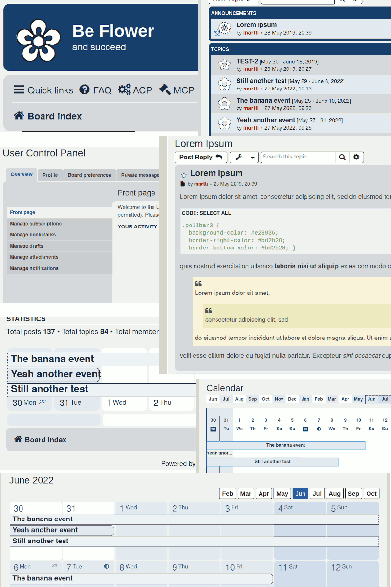

# phpBB style Be Flower

[Topic on phpbb.com](https://www.phpbb.com/community/viewtopic.php?f=691&t=2548861)

phpBB 3.3+ Style pased on prosilver with several color variations.

## Be Flower Red

## Be Flower Purple

## Be Flower Olive

## Be Flower Green

## Be Flower Blue

## Be Flower Black Yellow

## Be Flower Black Red

## Be Flower Black Purple

## Be Flower Black Green

## Be Flower Black Blue

## Be Flower Black

## License

[GPLv2](license.txt)
